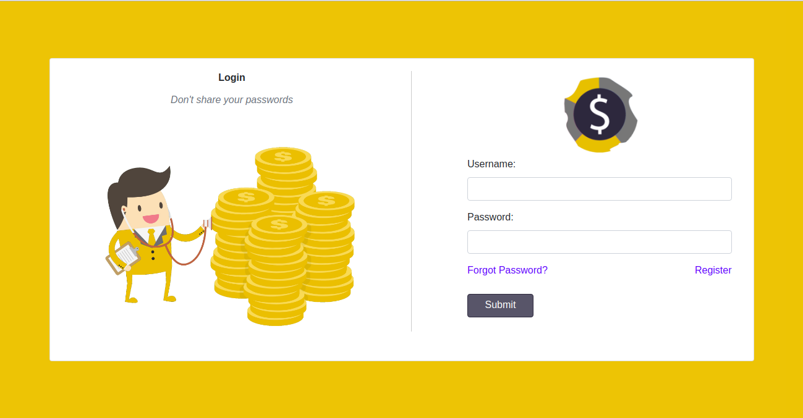
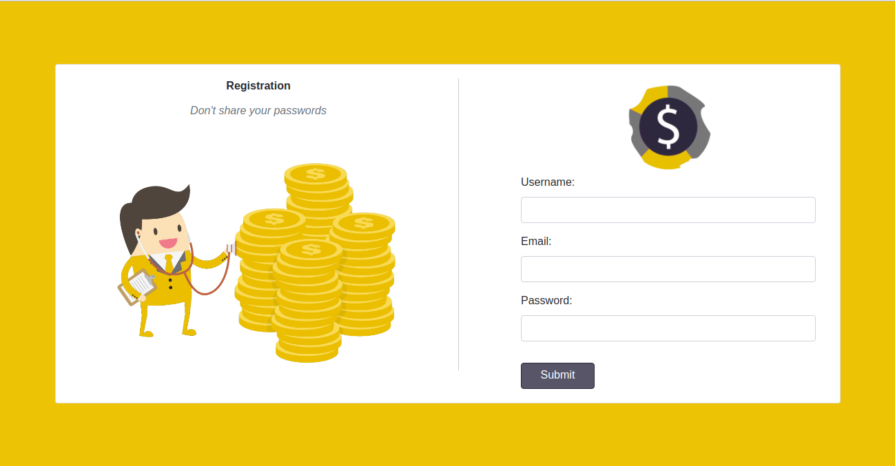
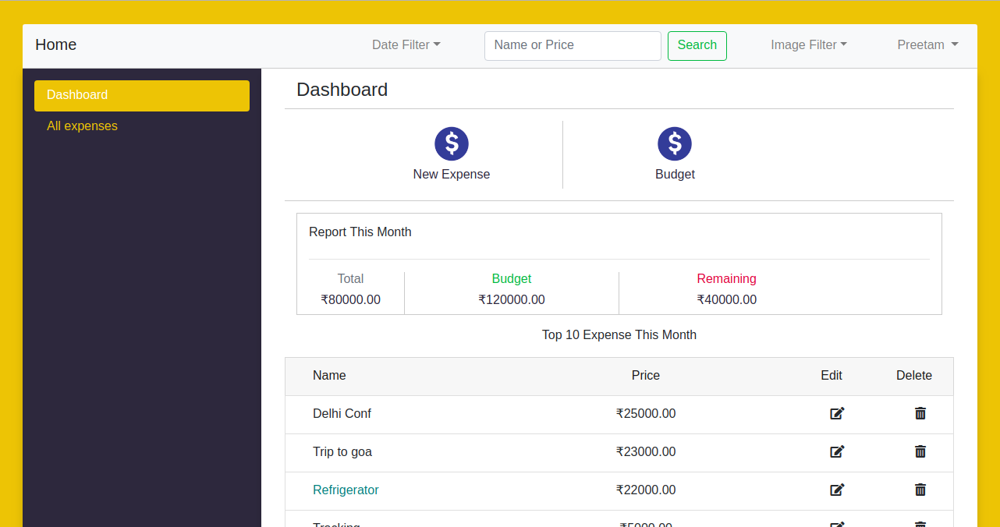
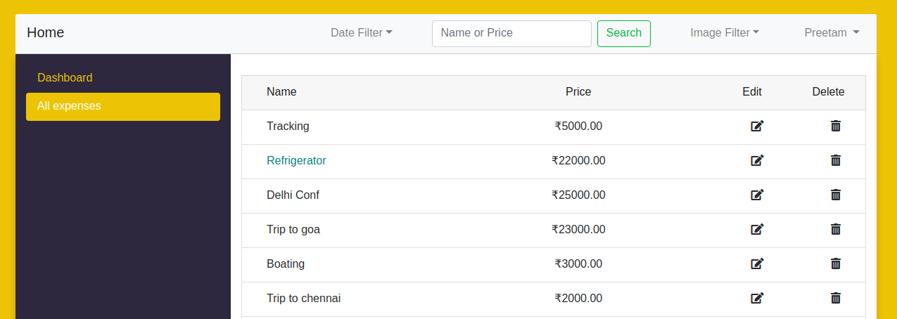

# Expense Tracker


Expense Manager is simple, stable and feature-rich web app that is designed for manage your daily bills.

## Features

* Open Source
* Powered by Django, Bootstrap
* Filtering by name, price
* Sorting by Date, Image Availability
* Total Expense Monthly with budget feature


## Table of Contents
1. [ScreenShots](#screenshots)
2. [Installation](#installation)

## Screenshots









## Installation

1. [Python3](https://www.python.org/downloads/) required
2. [Pipenv](https://docs.pipenv.org/) required
```
    pip3 install pipenv
```
3. Install all dependencies for this project
```
    pipenv install
```
4. add secrets.json
``` 
    cp docs/extras/secrets_example.json secrets.json
```
5. add local.py
```
    cp docs/extras/local_example.py website/settings/local.py
```
6. python manage.py createsuperuser
7. login with admin credentials at
```
 /admin/
 ```
8. create group <strong>expense_manger</strong>
9.  add permissions for expense_manger app


## Suggestions
Open to any suggestions and help provided.